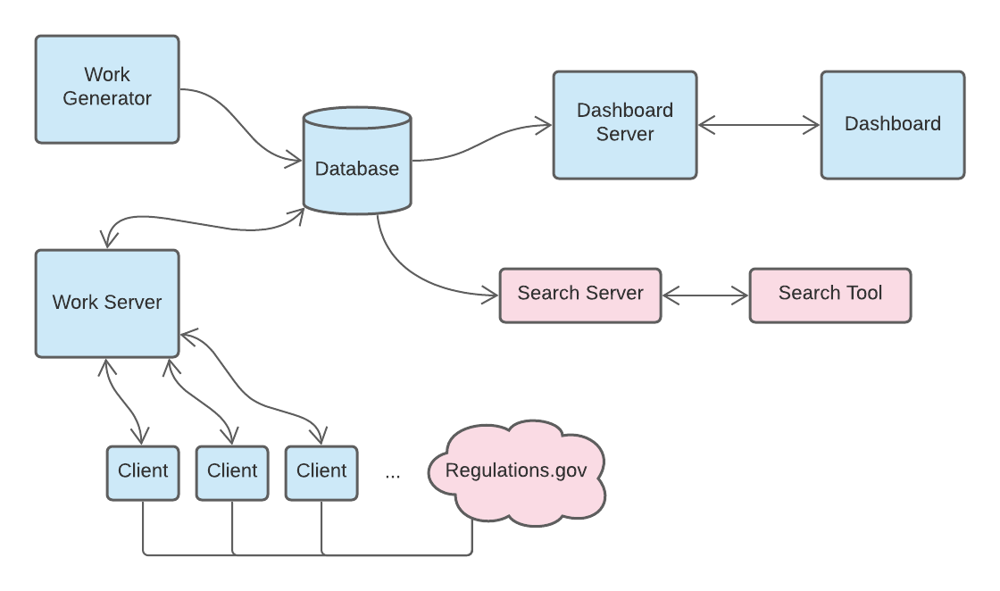

# Capstone2021

A complete senior capstone project.
The project requires use of a Python virtual environment and installation of the project as an editable module.
Additionally, we make use of make in order to run tests.


## Setup

* Create and activate a virtual environment

  ```
  python3 -m venv .venv
  source .venv/bin/activate
  ```

* Install source code as a module

  ```
  pip install -e .
  ```

* Download docket IDs into the src/c21server/data folder. For now they should be stored in said folder in a text file named `dockets_0.txt`
* The `dockets_0.txt` is needed in order to download data (for now), and it will be needed to run the vagrant instance as well. Check the [Production Docs](https://github.com/cs334s21/capstone2021/blob/main/docs/production.md) for more information on setting this up, along with details on how to run this virtually on your local machine. 
* Lastly, the client needs an api key in order to properly make the calls to [regulations.gov](https://www.regulations.gov/). In `src/c21client`, make a `.env` file with the contents `API_TOKEN=[insert your api key here]`. To get an api key, visit [here](https://open.gsa.gov/api/regulationsgov/). Check [client docs](https://github.com/cs334s21/capstone2021/blob/main/docs/client.md) for more information.
* For more guidance on specific aspects of the project, visit the [docs](https://github.com/cs334s21/capstone2021/blob/main/docs/). 

## Run Static Analysis and Tests

Type `make` to run all. 

Type `make static` for only static tests.

Type `make test` for only pytest.

* Static analysis using `flake8`, `pycodestyle`, and `pylint`
* Run `pytest` with coverage.  The coverage metric is set to 95%.
* Sometimes if `pytest` is installed globally, the virtual environment will use that instead. Simply exit and reenter the virtual environment to resolve this.

## Architecture
The image below shows the overview of the architecture for our system. Right now, the portions in blue are implemented at a basic level. Those in red are the remaining parts we need to connect. Regardless, the image shows the relationship between the working plumbing but also includes the plan over the next few weeks.


## Contributors
* Abdullah Alharbi (alharbia02@moravian.edu)
* Alex Meci (mecia@moravian.edu)
* Ben Coleman (colemanb@moravian.edu)
* Colby Hillman (hillmanc@moravian.edu)
* Emily Heiser (heisere@moravian.edu)
* Francis Severino-Guzman (severinoguzmanf@moravian.edu)
* Jarod Frekot (frekotj@moravian.edu)
* John Lapatchak (lapatchakjrj@moravian.edu)
* Jonah Beers (beersj02@moravian.edu)
* Jorge Aguilar (aguilarj@moravian.edu)
* Juan Giraldo (giraldoj@moravian.edu)
* Kylie Norwood (norwoodk@moravian.edu)
* Larisa Fava (faval@moravian.edu)
* Riley Kirkpatrick (kirkpatrickr@moravian.edu)
* Trae Freeman (freemant02@moravian.edu)
* William Brandes (brandesw@moravian.edu)
